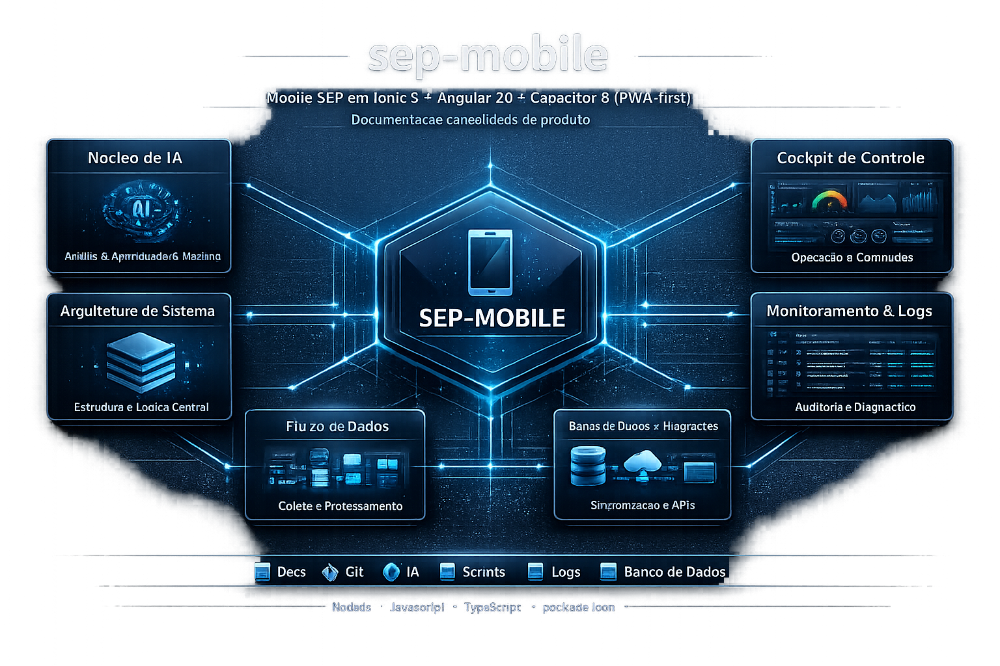

# sep-mobile

Mobile SEP em Ionic 8 + Angular 20 + Capacitor 8 (PWA-first).

> Documentacao consolidada do produto vive no repositorio [`docs-SEP`](../docs-SEP):
> [PRD](../docs-SEP/docs-sep/PRD.md), [CONTEXT](../docs-SEP/docs-sep/CONTEXT.md), [AGENT.md](../docs-SEP/AGENT.md), [ADRs](../docs-SEP/adr/), [specs](../docs-SEP/specs/), [steps mobile](../docs-SEP/steps-fase-1/mobile/) e [docs especificos do mobile](../docs-SEP/repos/sep-mobile/).

## Infográfico Geral



## Setup do desenvolvedor

Apos clonar o repositorio:

1. Instalar Node.js LTS `>= 20.x`
2. `npm ci --legacy-peer-deps` — `legacy-peer-deps` necessario porque `@angular/build` declara `vitest@^3.1.1` como peer optional, mas pinamos `vitest@^2` por compatibilidade com `@analogjs/vitest-angular@^1`
3. `npm run start` — sobe dev server PWA em `http://localhost:8100/`

Husky + lint-staged sao instalados automaticamente via `prepare` script no `npm install`.

## Scripts npm

| Script                  | O que faz                                                         |
| ----------------------- | ----------------------------------------------------------------- |
| `npm run start`         | Dev server PWA em `http://localhost:8100/`                        |
| `npm run build`         | Build PWA em `www/`                                               |
| `npm run watch`         | Build em modo watch (development config)                          |
| `npm run lint`          | ESLint para TS + HTML                                             |
| `npm run lint:scss`     | Stylelint para SCSS (whitelist `--ion-*`)                         |
| `npm run lint:scss:fix` | Stylelint com `--fix`                                             |
| `npm run format`        | Prettier --write                                                  |
| `npm run format:check`  | Prettier --check                                                  |
| `npm run test`          | Vitest (1 run)                                                    |
| `npm run test:watch`    | Vitest watch                                                      |
| `npm run test:coverage` | Vitest com cobertura v8 em `coverage/`                            |
| `npm run e2e`           | Playwright (Pixel 5 / Chromium) com webServer auto                |
| `npm run e2e:ui`        | Playwright em UI mode                                             |
| `npm run cap:add`       | `cap add` (Capacitor — Android/iOS, fora de escopo da M-Sprint 0) |
| `npm run cap:sync`      | `cap sync`                                                        |

## Code Style

- ESLint 9 (flat config) — `eslint.config.js`
- Prettier 3 — `.prettierrc.json`
- Stylelint 16 (config standard SCSS) — `.stylelintrc.json` com whitelist `--ion-*`
- Husky 9 + lint-staged 15 (pre-commit auto-fix)
- Prefixo de seletor Angular: `sep` (componente kebab-case, diretiva camelCase)

## Testes

- **Unit**: Vitest 2 + `@analogjs/vitest-angular` (compila templates Angular).
- **E2E PWA**: Playwright 1 (Pixel 5 / Chromium) com webServer auto em `http://127.0.0.1:8100`.
- **Mock API**: MSW 2.x. Worker browser ativo via flag em runtime: `localStorage.setItem('NG_APP_USE_MSW', 'true')` + reload. Handlers cobrem perfil **CLIENTE** (escopo tomador/credora).

> MSW server (Node) sera plugado em `src/test-setup.ts` na M-Sprint 2/3, quando os primeiros testes que dependem da API entrarem. Os polyfills necessarios (Web Streams + BroadcastChannel) ja estao prontos em `src/test-polyfills.ts`.

## Estrutura de pastas

```
src/
├── app/
│   ├── core/              # auth, http, config, guards, interceptors, storage (Capacitor Preferences)
│   ├── shared/            # components, directives, pipes, models, utils
│   ├── layout/            # public-shell, mobile-tabs, stack-shell
│   ├── features/
│   │   ├── public/        # splash, boas-vindas, login, register
│   │   ├── tomador/       # jornada do tomador
│   │   └── credora/       # jornada da empresa credora
│   ├── home/              # home placeholder do scaffold (sera substituido)
│   ├── app.component.ts   # componente raiz (selector: sep-root)
│   ├── app.routes.ts
│   └── app.component.spec.ts  # smoke Vitest
├── mocks/                 # MSW handlers + browser/server (perfil CLIENTE)
├── styles/                # tokens, mixins, notion-mobile, ionic-overrides (M-Sprint 1)
├── theme/                 # variables.scss padrao Ionic
├── test-polyfills.ts      # polyfills MSW (uso futuro)
├── test-setup.ts          # init TestBed Angular
├── main.ts
├── global.scss            # estilos globais Ionic
└── index.html
```

A separacao por **jornada** (tomador/credora) materializa o escopo reduzido do mobile (PRD §22, ADR 0003): sem financeiro interno, backoffice ou administracao completa nesta fase. Todo mobile (visitante e autenticado) segue o design system Notion adaptado para toque.

## Capacitor

`capacitor.config.ts` configurado com:

- `appId: 'com.dynamis.sep.mobile'`
- `appName: 'SEP'`
- `webDir: 'www'`

**Android e iOS** ficam fora do escopo da M-Sprint 0 (PWA-first). Adicao via `cap:add` entra na Epic 14 Fase Mobile 2+, depois da estabilizacao das M-Sprints 0-4.

## Continuous Integration

`.github/workflows/ci.yml` (`name: CI-MOBILE`) roda em pushes para `feature/**`, `develop` e `main`, alem de PRs para `develop` e `main`.

A pipeline tem duas fases:

1. `Test, Lint, Coverage` — instala dependencias com `npm ci --legacy-peer-deps`, roda `format:check`, `lint`, `lint:scss` e `test:coverage`, e publica o artifact `mobile-coverage` (relatorio v8) com retention 14 dias.
2. `Build PWA` — depende da fase anterior, reinstala dependencias com `npm ci --legacy-peer-deps`, roda `npm run build`, valida a existencia de `www/` e publica o artifact `mobile-pwa-www` com retention 14 dias.

## Stack

- Ionic 8 + Angular 20.3.x (Standalone Components, Signals, strict)
- Capacitor 8.3 (Ionic CLI gerou Cap 8 por default; PRD/ADR 0003 originalmente apontavam Cap 6 — atualizar Ionic e mais alinhado que regredir Capacitor)
- SCSS puro — sem Bootstrap/Tailwind/Material; componentes Ionic customizados via CSS variables
- ESLint 9 + Prettier 3 + Stylelint 16
- Husky 9 + lint-staged 15
- Vitest 2 + `@analogjs/vitest-angular` 1 + happy-dom
- Playwright 1 (Chromium em viewport mobile)
- MSW 2

Detalhes: [PRD §11, §22](../docs-SEP/docs-sep/PRD.md), [ADR 0003](../docs-SEP/adr/0003-stack-angular-20-ionic-8-capacitor-6.md).

## Conventional Commits

Mensagens de commit seguem [Conventional Commits](https://www.conventionalcommits.org/pt-br/v1.0.0/).
Exemplos:

```
feat(tomador): adicionar tela de solicitar emprestimo
fix(layout): corrigir tab inferior em iOS PWA
chore: atualizar Ionic 8.5
docs(adr): atualizar ADR 0003 sobre Capacitor 8
```

## Marco regulatorio

SEP opera sob a Resolucao CMN 4.656/2018. Mobile cobre apenas as jornadas de **tomador** e **empresa credora** (PRD §22, Epic 14). Mobile **nao concentra regra de negocio** — todas as decisoes de credito, status, permissoes e dados operacionais vem da API.

## M-Sprints

- M-Sprint 0 — Setup Ionic + Tooling (este branch)
- M-Sprint 1 — Tokens Notion adaptados (touch, tabs inferiores) + Showcase
- M-Sprint 2 — Splash/Boas-vindas/Login/Register com MSW + Capacitor Preferences
- M-Sprint 3 — Auth real, Shell mobile, Guards, Interceptors
- M-Sprint 4 — Perfil/Senha + Casca tomador + Casca credora + Smoke E2E PWA

Detalhamento: [docs-SEP/specs/fase-1/](../docs-SEP/specs/fase-1/) (200-204) e [docs-SEP/steps-fase-1/mobile/](../docs-SEP/steps-fase-1/mobile/).
